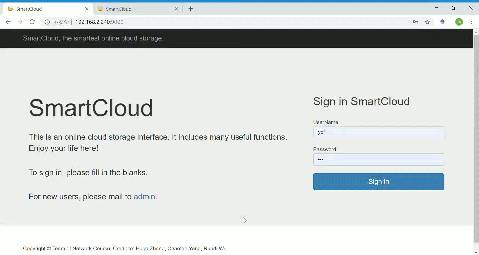
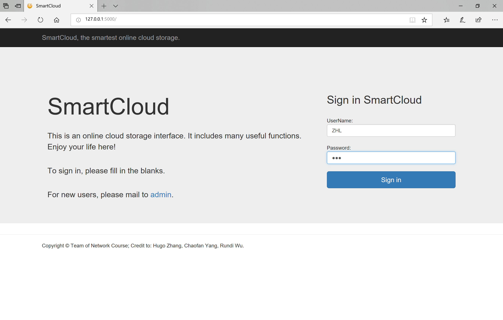
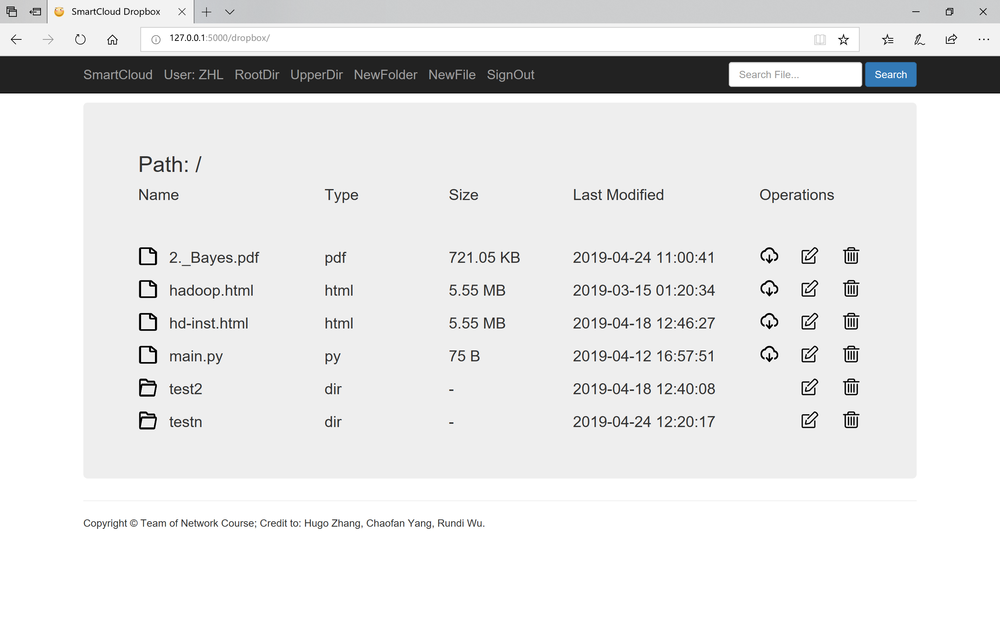
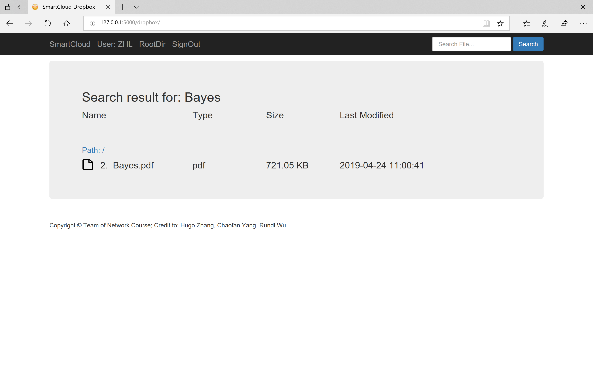

# SmartCloud

* A smart implementation of cloud storage.

## File structure

* **main.py** : run the server
* **router.py** : routers, implement functions for different urls
* **util.py** : assisting functions for routers
* **templates** : html templates
* **static** : static resources used by html templates
* **register.py** : a script to register new users
* **sync.sh** : implement synchronization mechanism between two servers
* **smartcloud.ini**, **smartcloud.conf** : configurations for deployment

## Usage

* To run the server locally: run the **main.py** script.
* To register new users: run the **register.py** script (-h flag for help).
* To implement deployment and intranet penetration: https://blog.csdn.net/qq_37289362/article/details/91324974 .
* To implement synchronization: https://blog.csdn.net/zpf336/article/details/51659666 .
* Have a try: modify the root dir in **util.py**, register some users, run the server, and use your username to login in!

## Demos

 

Here shows some of the operations.

* Type the correct username and password to login:
* In dropbox page, one can choose buttons in operations column (**download**, **rename**, **delete**), on the navigation bar (**go back to root directory**, **go back to upper directory**, **make new folder**, **upload new file**, **signout**), or before every folder name (**go into folder**). Users can also **search** for files or folders by name in the search area. 
* When searching for specific files or folders, one can dive into their upper directory. 
* If using synchronization, every user will have a sync-folder in root directory, which cannot be deleted. Every file and folders saved in sync-folder on another server will be synchronized to this server when logining in.

## Contributions

* [Hailin Zhang](https://github.com/HugoZHL): front-end and back-end interaction, testing.
* [Chaofan Yang](https://github.com/mrmrfan): deployment and intranet penetration, synchronization.
* [Rundi Wu](https://github.com/ChrisWu1997): utility functions.
